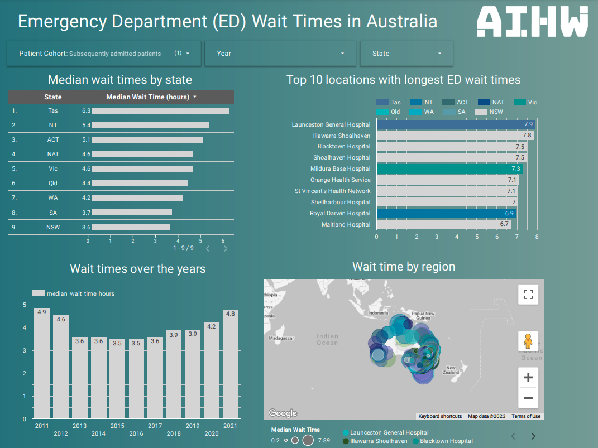
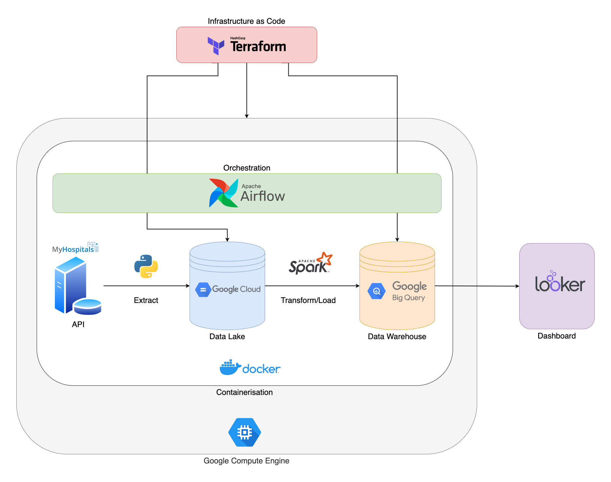
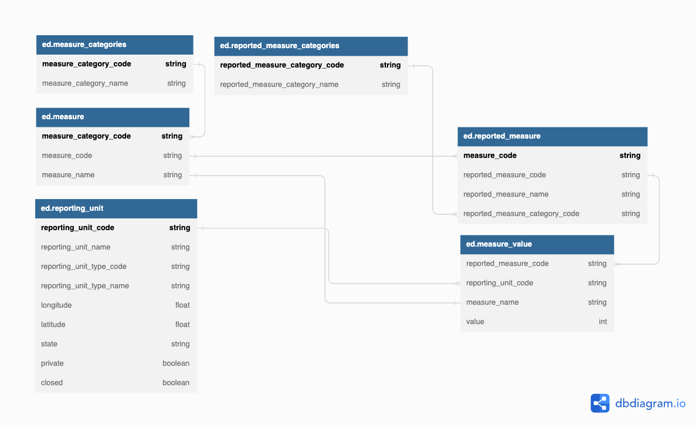

# Data Engineering Project by Kelvin Ye <br> Emergency Department Wait Times in Australia



[Looker Studio Dashboard Link](https://lookerstudio.google.com/s/p4zWkrCVhh8)

## Problem statement

Patient care and wait time management in emergency departments (ED) remains an area for improvement around the world. This project aims to analyse and identify ED wait time data in Australia based on various factors such as location (state and hospital) and year with the aim of improving decisions for resourcing, funding and patient care. 

This project idea arose from a bad personal experience waiting in the emergency room for over 10 hours through the night to get attention for a head injury. 

## Architecture Diagram



- Extract JSON data from MyHospitals Data API into Google Cloud Storage using pandas
- Transform and load data into BigQuery
- Orchestrate ETL process with Airflow running on Docker container running on Virtual Machine initialised by Terraform
- Connect BigQuery table to Looker Studio dashboard

## Set Up

****************************************Google Cloud Project****************************************

- [Create new project](https://console.cloud.google.com/projectcreate)
- [Enable Compute Engine API](https://console.cloud.google.com/apis/library/compute.googleapis.com)
- [Enable IAM API](https://console.cloud.google.com/apis/library/iam.googleapis.com)
- [Enable IAM Credentials API](https://console.cloud.google.com/apis/library/iamcredentials.googleapis.com)

**Google Cloud Service Account**

- [Create Service Account](https://console.cloud.google.com/projectselector2/iam-admin/serviceaccounts/create)
    - Roles: `Viewer`, `Storage Admin`, `Storage Object Admin`, `BigQuery Admin`, `Compute Admin`, `Computer Network Admin`, `Service Account User`
    - From [the service account key page in the Cloud Console](https://console.cloud.google.com/iam-admin/serviceaccounts) choose an existing account.
    - Manage Keys > Add Key > Create New Key > JSON > Create to download the JSON key file into `~/.gc/gc-key.json`
- Authenticate Service Account
    
    ```bash
    echo "export GOOGLE_APPLICATION_CREDENTIALS=\"$HOME/.gc/gc-key.json\"" >> "$HOME/.bashrc"
    source "$HOME/.bashrc"
    ```
    

**************Install Terraform**************

[https://developer.hashicorp.com/terraform/tutorials/aws-get-started/install-cli](https://developer.hashicorp.com/terraform/tutorials/aws-get-started/install-cli)

************************************************Install Google Cloud SDK************************************************

[https://cloud.google.com/sdk/docs/install](https://cloud.google.com/sdk/docs/install)

**Generate SSH Key**

```bash
mkdir ~/.ssh
ssh-keygen -t rsa -f ~/.ssh/ssh-key -C kelvin -b 2048
# Ref: [https://cloud.google.com/compute/docs/connect/create-ssh-keys](https://cloud.google.com/compute/docs/connect/create-ssh-keys)
```

## Run

**Terraform**

```bash
git clone https://github.com/kelvinyrb/de-project.git
cd terraform
terraform init
terraform apply
```

********SSH into Google Compute VM********

```bash
# Edit HostName to the External IP of VM instance on Google Cloud
echo "Host terraform-instance
    HostName 34.129.206.109
    User user
    IdentityFile ~/.ssh/ssh-key" | tee -a ~/.ssh/config
```

- Open remote window on VSCode
- Connect to Host
- Select terraform-instance
- Open integrated terminal

************Docker************

```bash
# Inside the VM, do this
docker-compose build
docker-compose up -d
```

**************Airflow**************

- Forward port 8080 on VSCode
- Access via localhost:8080
- Sign in (user: airflow, pwd: airflow)
- Unpause DAG

****************************Looker Studio****************************

- [https://lookerstudio.google.com/](https://lookerstudio.google.com/)
- Create > Data Source
- BigQuery
- Select project > dataset > table > Connect
- Customise dashboard

**Post-process**

```bash
# Inside the VM, do this
docker-compose down
exit

# On your machine, do this
cd terraform
terraform destroy
```

## MyHospitals Data API

### Overview

The MyHospitals (API) provides access to a selection of hospital data in Australia. The API is open and free to use.

[https://myhospitalsapi.aihw.gov.au/index.html](https://myhospitalsapi.aihw.gov.au/index.html)

[https://www.aihw.gov.au/reports-data/myhospitals/sectors/emergency-department-care](https://www.aihw.gov.au/reports-data/myhospitals/sectors/emergency-department-care)

### Data Structure in Data Lake

Once the data is extracted from the API, it is stored on the data lake with the below data structure. 



## Pipeline Overview

********************Terraform********************

- Create Google Compute VM Resource
    - Copy service account key into VM
    - Authenticate Service Account
    - Install Docker and docker-compose
- Create VM Public Address Resource
- Create Google Cloud Storage Resource
- Create Google BigQuery Dataset Resource

**Dockerfile**

- apache/airflow:2.3.3 base image
- Install Google Cloud SDK
- Install OpenJDK (Java)
- Install Spark
- Download GCS and BigQuery connectors
- Install PySpark via pip

********docker-compose.yaml********

- airflow-init
- airflow-scheduler
- airflow-webserver
- postgres

**********************Airflow DAG**********************

- Ingest API data into Data Lake (PythonOperator)
- PySpark transform/load to Data Warehouse (BashOperator)

Big thank you to [DataTalksClub](https://datatalks.club/) for teaching me the tools and making this project possible through their 100% free [Data Engineering Zoomcamp](https://github.com/DataTalksClub/data-engineering-zoomcamp)!